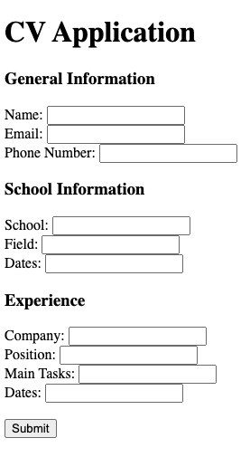

# cv-application

A curriculum vitae application.

This program utilizes Reacts components, props, and state, to join multiple forms together.

    

## Features

- Built with React.
- Utilizes props and state.
- Loads multiple components onto the page via ES6 modules.

## Demo

- https://cameronstamant.github.io/cv-application/
